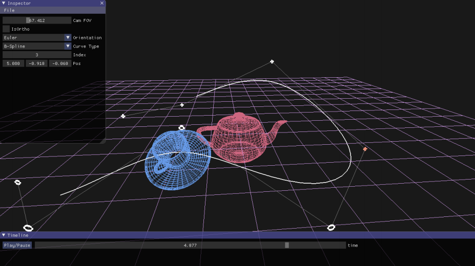
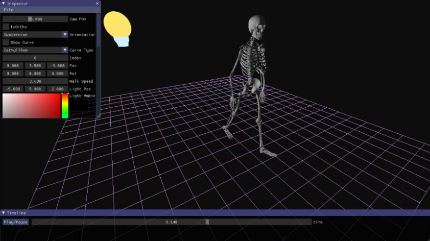
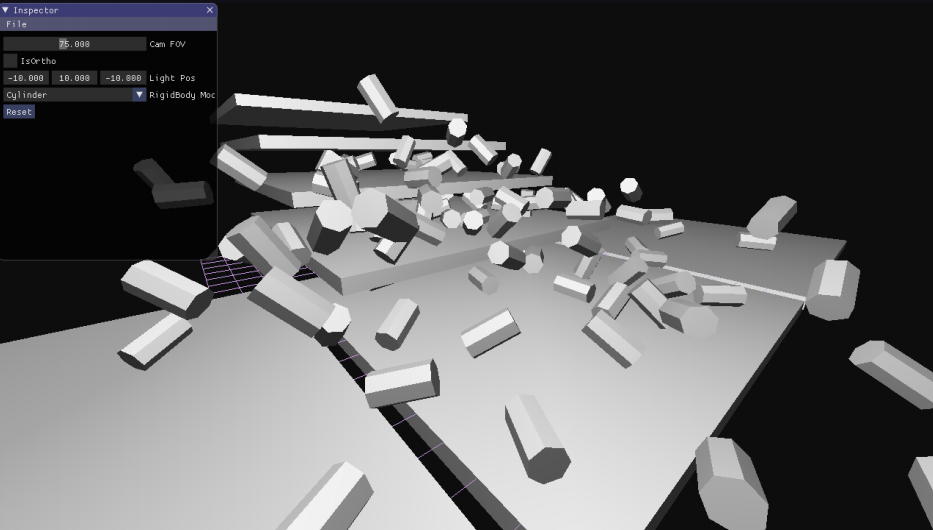
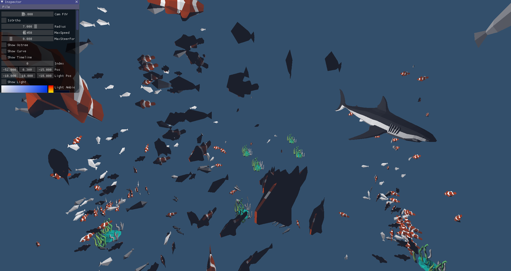
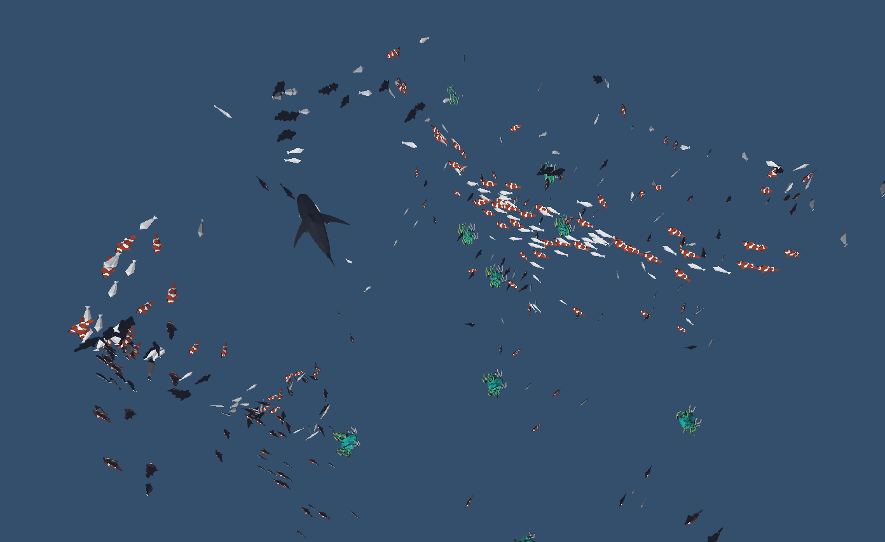
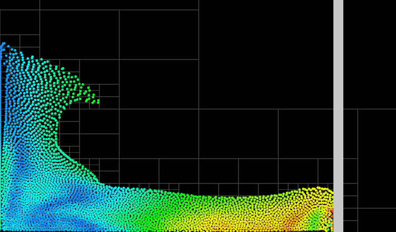

# OpenGLAnimation
CS6555 Project

## Lab1 Euler and Quaternion

## Lab2 Hierarchical Animation

## Lab3 Rigid Body Collisions (Separating Axis Theorem)

## Lab4 Boid Simulation

## Lab5 SPH Fluid Simulation
